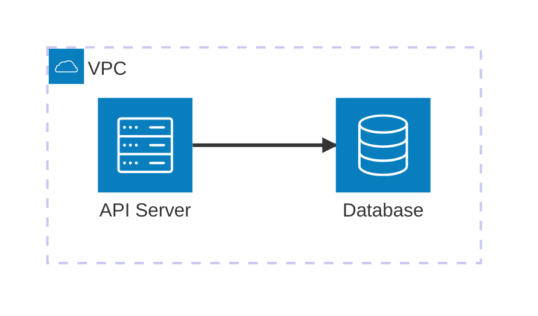
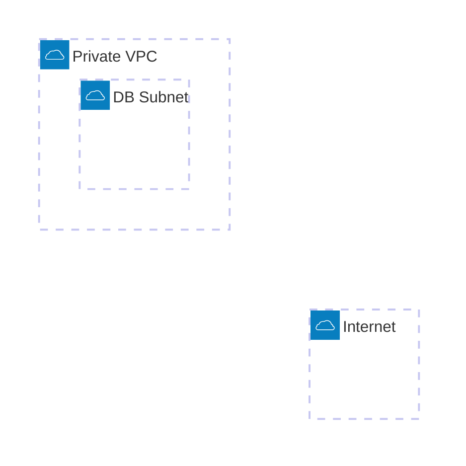
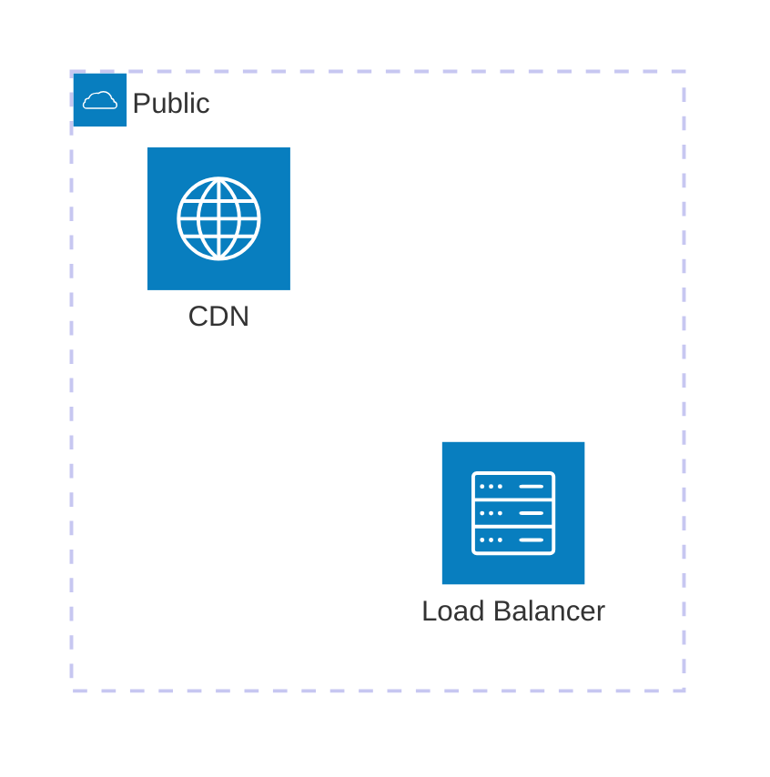
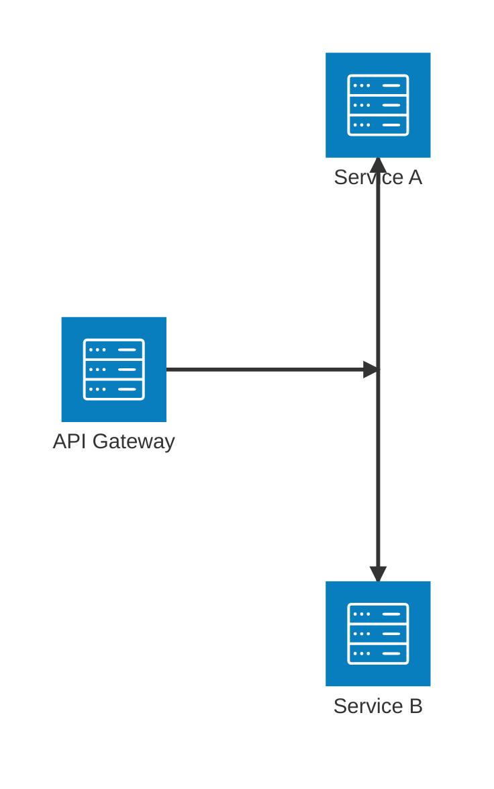
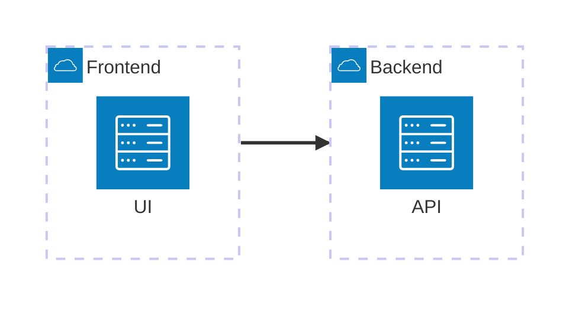
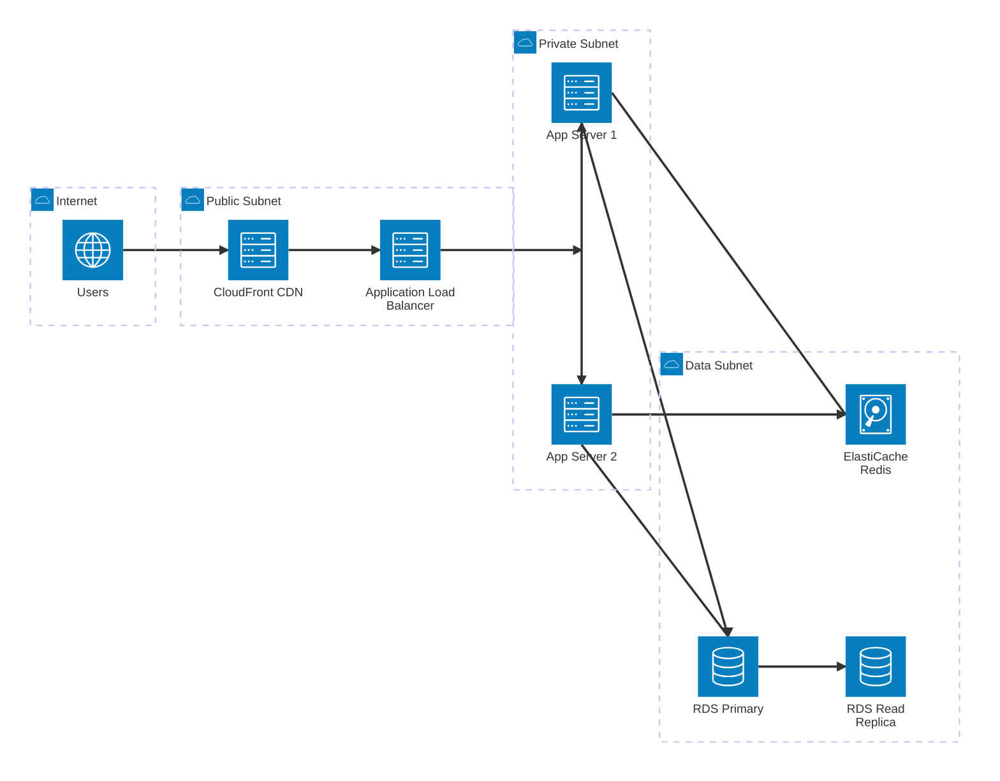
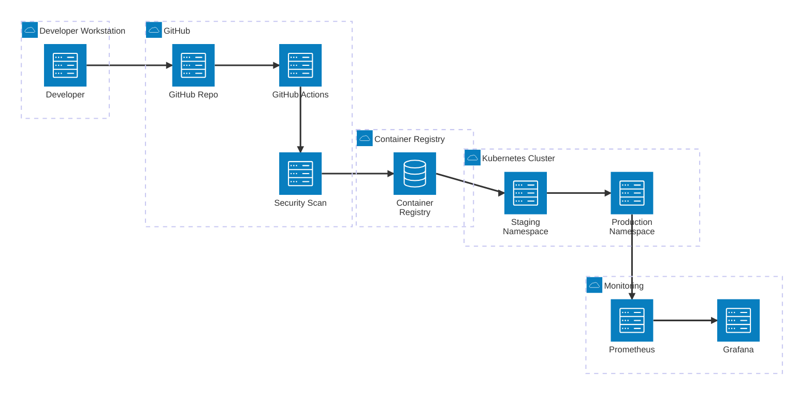
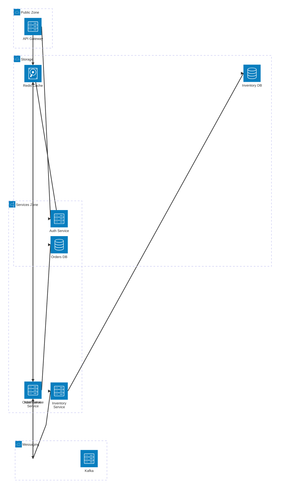

# Architecture Diagrams Reference

Architecture diagrams visualize cloud infrastructure, CI/CD pipelines, and service topology using Mermaid's
`architecture-beta` syntax (requires Mermaid v11.1.0+).

> **Note:** This is a distinct diagram type from flowcharts — it uses a dedicated `architecture-beta` block with its own
> primitives (`group`, `service`, `junction`).

## Basic Syntax



## Building Blocks

### Groups — logical boundaries

```text
group {id}({icon})[{label}] (in {parentGroupId})?
```

Groups represent environments, VPCs, networks, or logical layers:



### Services — nodes / components

```text
service {id}({icon})[{label}] (in {groupId})?
```



### Junctions — fan-out / fan-in points

```text
junction {id} (in {groupId})?
```



## Edge Syntax

```text
{serviceId}:{side} {arrow} {side}:{serviceId}
```

**Sides:** `T` (top), `B` (bottom), `L` (left), `R` (right)

**Arrow types:**

- `-->` — directed (with arrowhead)
- `--` — undirected (no arrowhead)
- `<-->` — bidirectional


**Connecting groups** (using `{group}` modifier on the service):



## Built-in Icons

| Icon name | Represents |
|-----------|-----------|
| `cloud` | Cloud / internet |
| `database` | Database / storage |
| `disk` | Disk / file system |
| `internet` | Internet / browser |
| `server` | Server / compute |

## Tech Brand Icons (with @iconify-json/logos)

Install with: `npm i @iconify-json/logos @mermaid-js/mermaid-cli`

Popular `logos:` icons:

- `logos:aws` `logos:azure` `logos:google-cloud`
- `logos:kubernetes` `logos:docker` `logos:terraform`
- `logos:github` `logos:github-actions` `logos:gitlab`
- `logos:prometheus` `logos:grafana` `logos:elasticsearch`
- `logos:nginx` `logos:redis` `logos:postgresql`
- `logos:kafka` `logos:rabbitmq`

Usage:

```mermaid
architecture-beta
    service k8s(logos:kubernetes)[Kubernetes]
    service registry(logos:docker)[Container Registry]
    registry:R --> L:k8s
```



## Full Example — AWS Three-Tier Web Application



## Full Example — GitHub Actions CI/CD Pipeline



## Full Example — Microservices with Message Broker



## Best Practices

1. **Group by boundary** — use groups for VPCs, environments (dev/staging/prod), layers (frontend/backend/data), or
   teams
2. **Consistent icons** — pick one icon per service type (all DBs use `database`, all servers use `server`) unless
   specifically differentiating
3. **Edge direction matters** — place services spatially so edges flow naturally (e.g., left-to-right for request flow)
4. **Label edges** when the protocol/relationship is non-obvious (HTTPS, gRPC, async, etc.) — though `architecture-beta`
   doesn't natively support edge labels, add a comment `%%` near the edge
5. **Junctions for fan-out** — use `junction` instead of showing multiple arrows from one source to keep the diagram
   clean
6. **Split large diagrams** — a 20+ service diagram is hard to read; split by layer or domain and cross-reference
7. **Nest groups sparingly** — up to 2 levels (e.g., region > VPC) works well; deeper nesting becomes hard to follow

## Limitations of architecture-beta

- Edge labels are not supported in `architecture-beta` — use comments or a legend
- Styling (CSS classes) is not supported — use icon choice and grouping to convey meaning
- Requires Mermaid v11.1.0+ — older renderers will fall back to an error; test on your target platform
- For very complex flows where you need labels on edges, consider using a `flowchart LR` instead with cylindrical/server
  shapes
