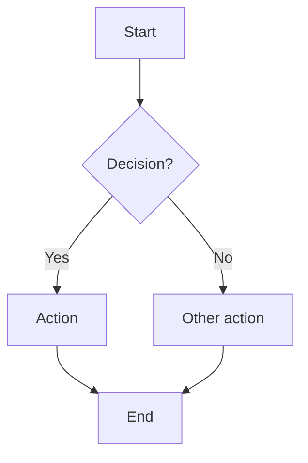
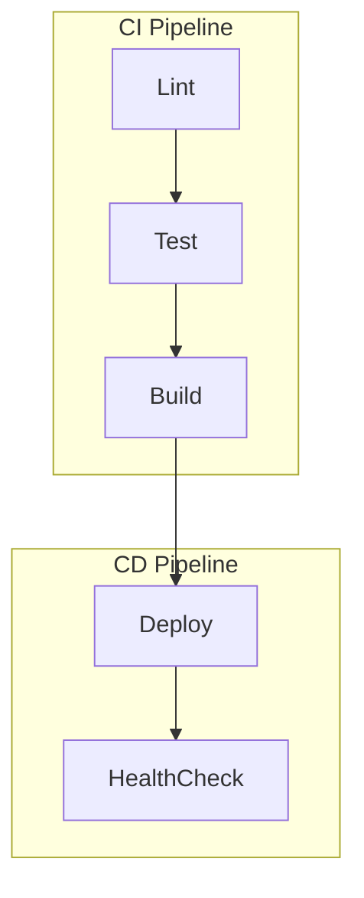
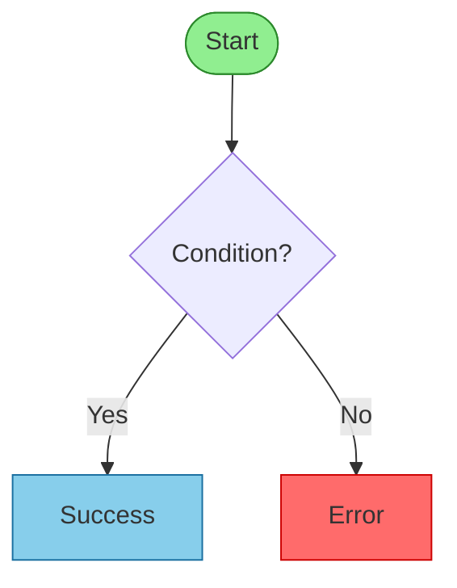
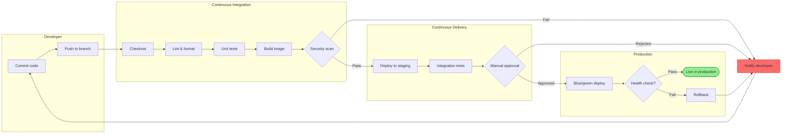
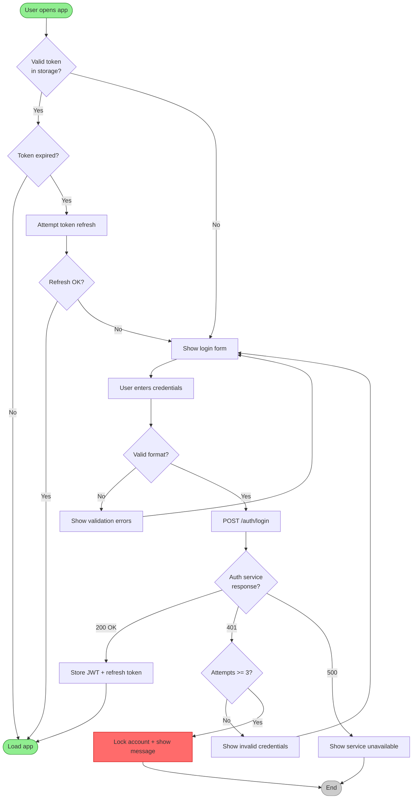
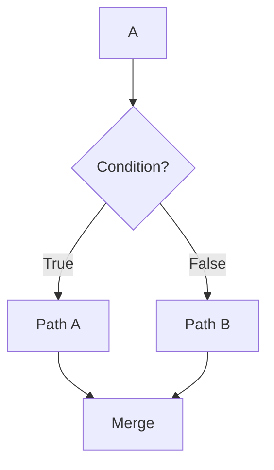
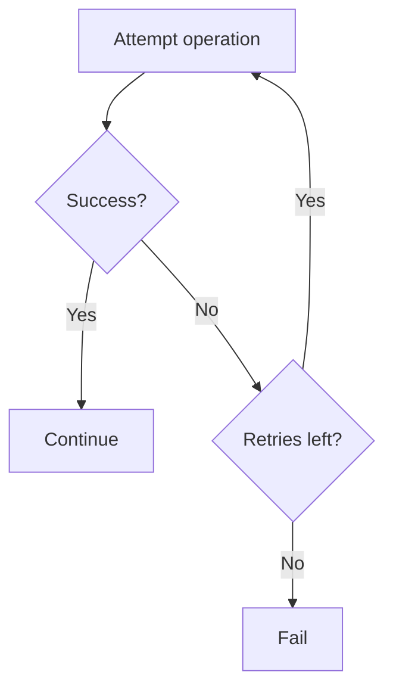
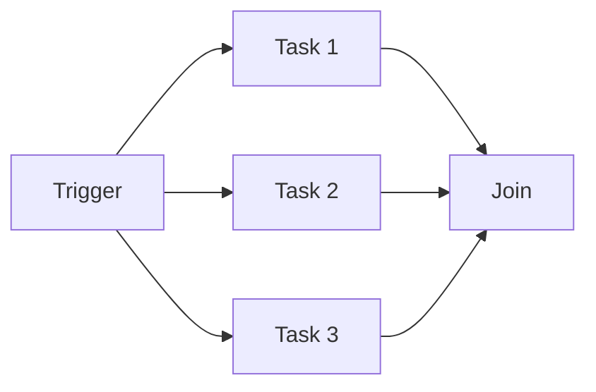

# Flowcharts Reference

Flowcharts visualize processes, algorithms, decision trees, and user journeys — anything with a sequential or branching
structure.

## Basic Syntax



**Direction:**

- `TD` / `TB` — Top to Bottom (default, best for processes)
- `LR` — Left to Right (best for pipelines, timelines)
- `BT` — Bottom to Top
- `RL` — Right to Left

## Node Shapes

| Shape | Syntax | Use for |
|-------|--------|---------|
| Rectangle | `A[Step]` | Process, action |
| Rounded rect | `A([Start/End])` | Start and end points |
| Stadium/Pill | `A(Step)` | Alternative rounded nodes |
| Rhombus | `A{Decision?}` | Decision / branching |
| Cylinder | `A[(Database)]` | Storage, databases |
| Circle | `A((Event))` | Events, triggers |
| Subroutine | `A[[Subprocess]]` | Sub-process / reusable block |
| Parallelogram | `A[/Input/]` | Input / output |
| Hexagon | `A{{Config}}` | Configuration / condition |

## Connections

```mermaid
flowchart LR
    A --> B                        %% Arrow
    C --- D                        %% No arrow
    E -->|Label| F                 %% Labeled arrow
    G -.-> H                       %% Dotted arrow
    I ==> J                        %% Bold arrow
    K -.->|Optional| L             %% Labeled dotted
```

## Subgraphs (grouping)



Subgraphs support their own `direction` directive.

## Styling



Alternatively use `style` for individual nodes:

```text
style NodeId fill:#color,stroke:#color,stroke-width:2px,color:#textcolor
```

## Full Example — CI/CD Pipeline



## Full Example — User Authentication Flow



## Common Patterns

### Decision + merge



### Retry loop



### Fan-out + join



## Best Practices

1. **Start/End**: always use `([Stadium])` shapes to mark entry and exit points
2. **Decisions as diamonds**: `{Question?}` for all branching
3. **Label every branch**: add `|Yes|` / `|No|` or meaningful labels on edges leaving decisions
4. **One direction**: choose `TD` or `LR` and stick to it; use subgraph `direction` to override locally
5. **Group with subgraphs**: cluster related steps by environment, team, or system boundary
6. **Color code**: use green for success/end, red for errors/failures, blue for main path
7. **Keep it focused**: one process per diagram; link to sub-diagrams for detail
