# Sequence Diagrams Reference

Sequence diagrams show interactions between participants over time — ideal for API flows, authentication sequences,
microservice communication, and any scenario where the *order* and *direction* of messages matters.

## Basic Syntax

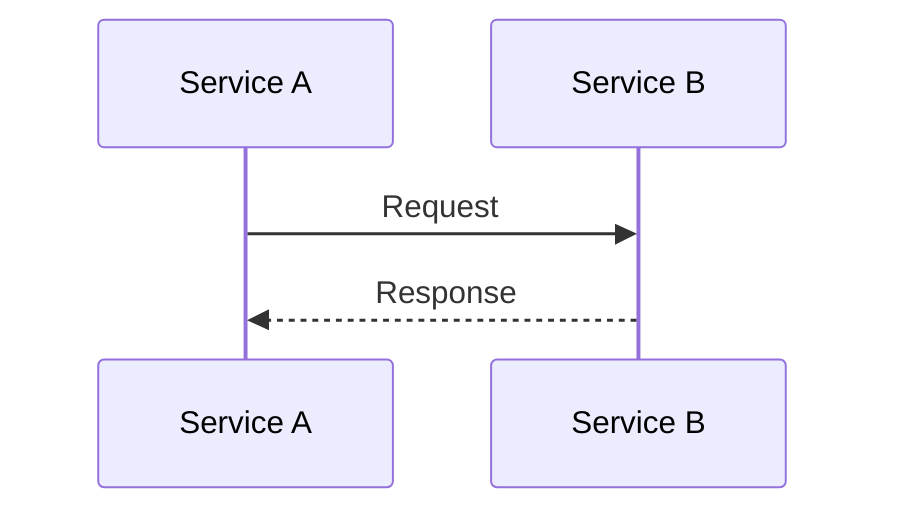

## Participants and Actors

- `participant` — system component (service, database, cache, class)
- `actor` — external entity (user, external system, browser)

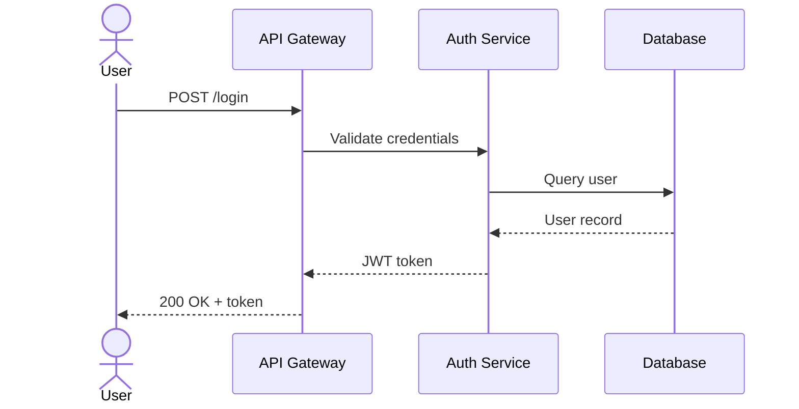

## Arrow Types

| Syntax | Meaning |
|--------|---------|
| `->>` | Solid arrow — synchronous request |
| `-->>` | Dashed arrow — synchronous response |
| `-)` | Open arrow — async message (fire and forget) |
| `--)` | Dashed open arrow — async response |
| `-x` | Cross — message terminated / deleted |
| `--x` | Dashed cross — async termination |

## Activations

Show when a participant is actively processing:

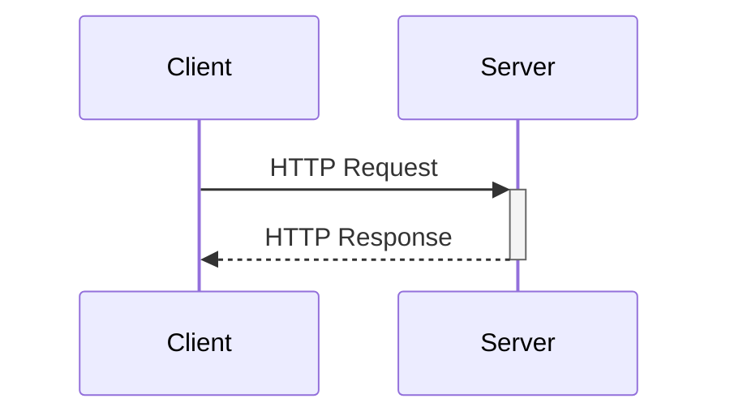

Use `+` to activate and `-` to deactivate. The `+` and `-` are appended to the arrow syntax.

## Control Flow

### Conditional: alt / else

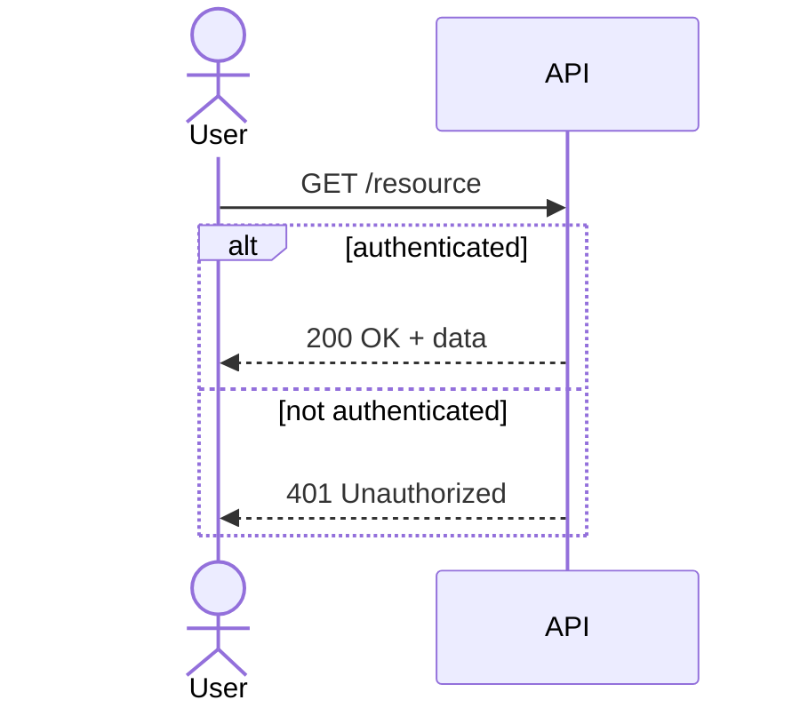

### Optional: opt

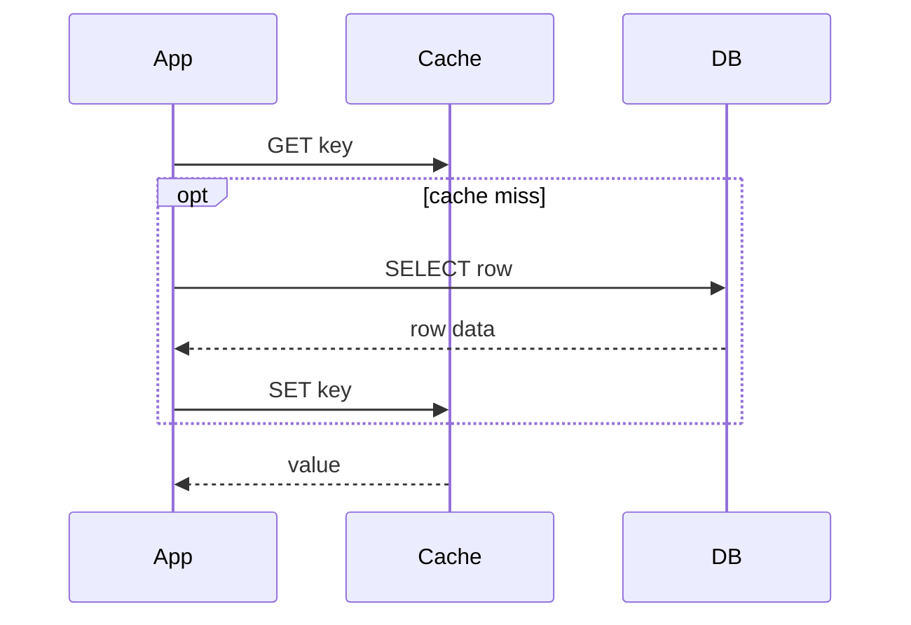

### Parallel: par

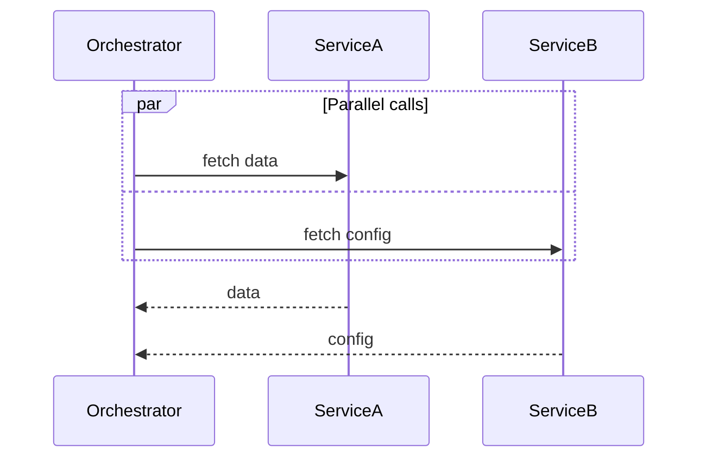

### Loop

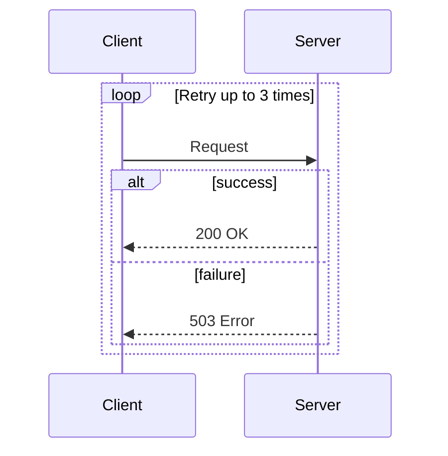

### Break (early exit)

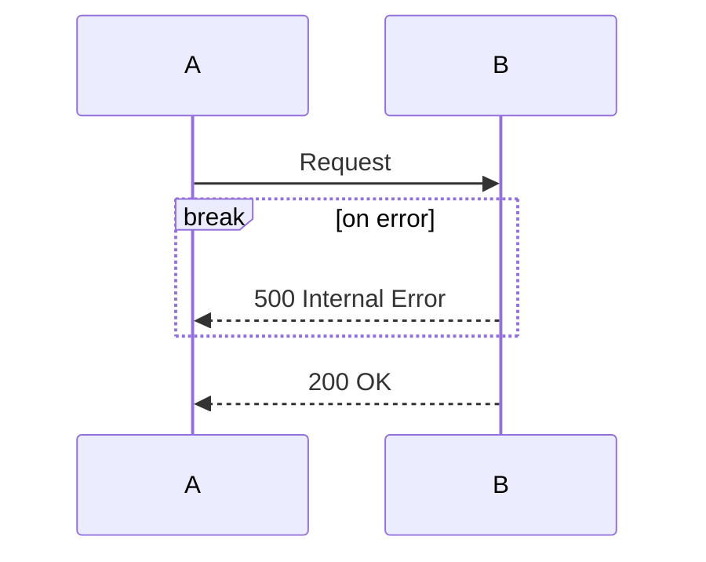

## Notes

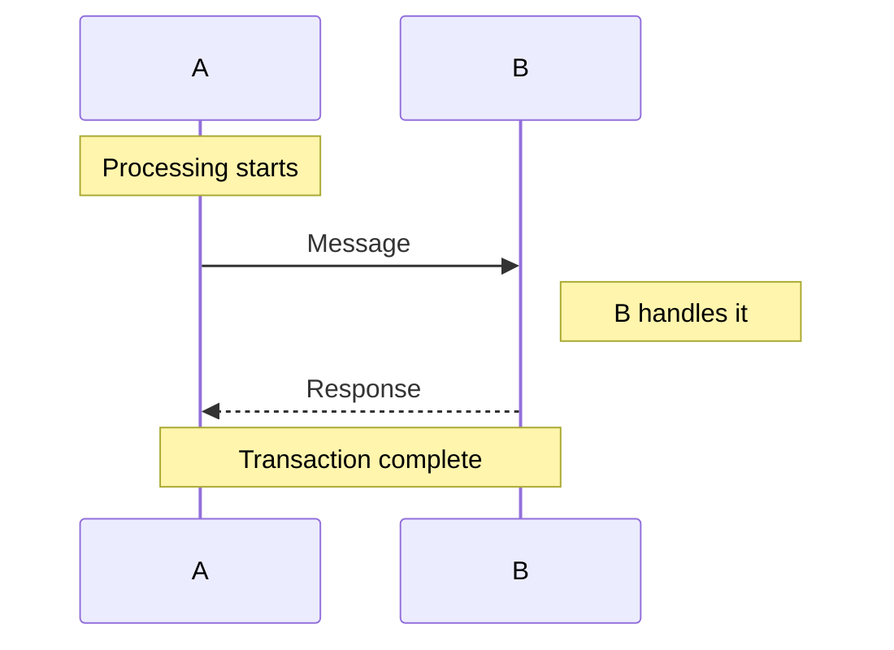

## Auto-numbering

Add `autonumber` to label each message step automatically:

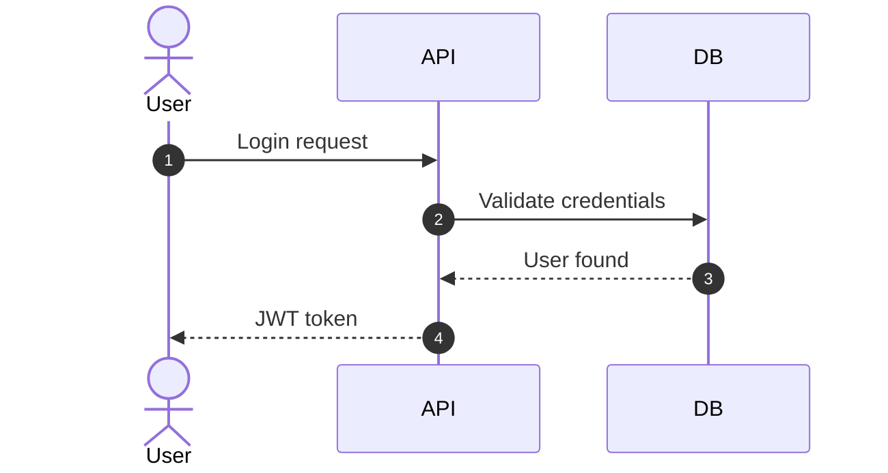

## Full Example — OAuth2 Authorization Code Flow

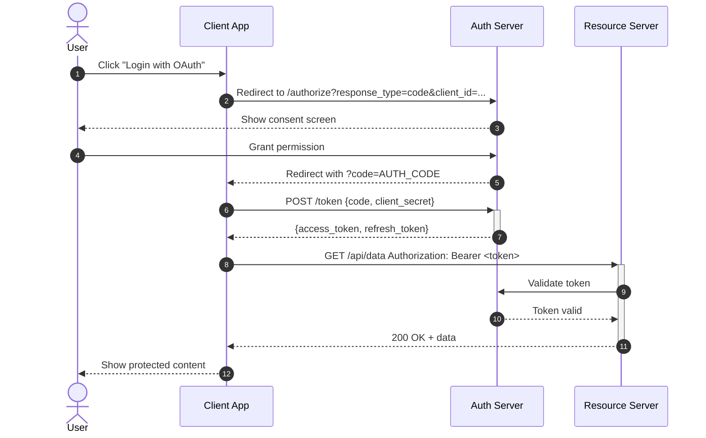

## Full Example — Microservices Order Processing

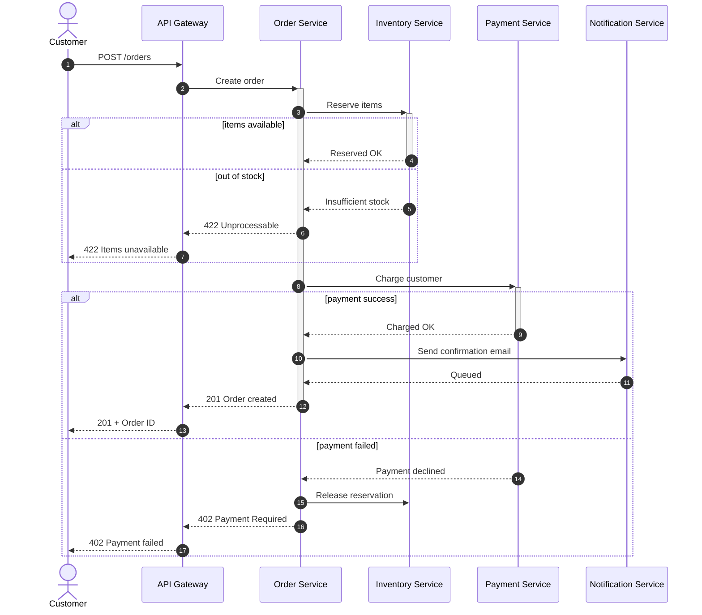

## Best Practices

1. Put actors on the left, databases/storage on the right
2. Use `autonumber` for flows with more than ~5 steps
3. Group related conditional logic with `alt`/`opt`
4. Show both success and error paths
5. Use activations (`+`/`-`) for long-running operations to show processing time
6. Keep participant names short; use `as` alias for display
7. Split very long sequences into sub-diagrams (e.g., auth flow + business logic separately)
